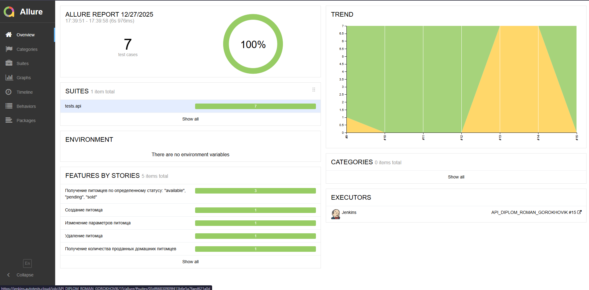
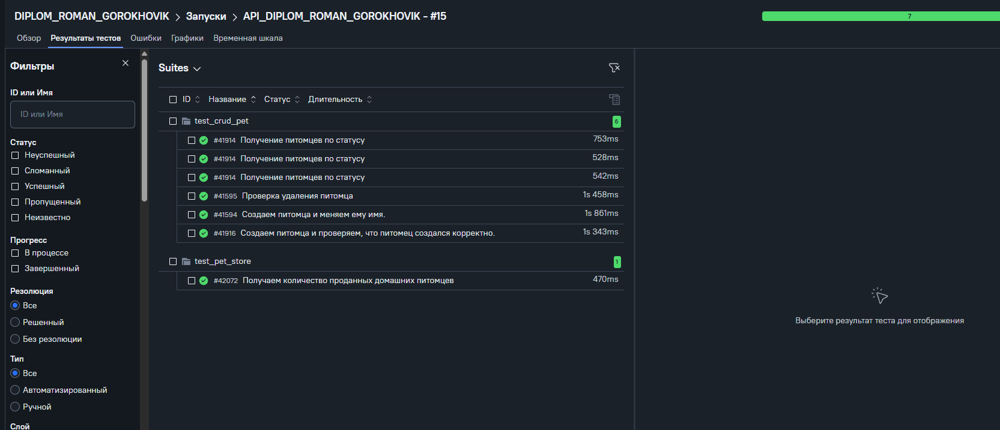

# Дипломный проект. Выполнение API-автотестов бесплатного сервиса "Petstore" 
> [Petstore](https://petstore.swagger.io/#/ )
> 


### Список реализованных API-тестов:

* ✅ Параметризация на получение питомцев со всеми статусами
* ✅ GET-запрос на получение определенного питомца по его id
* ✅ Создаем питомца и проверяем, что питомец создался корректно
* ✅ Создаем питомца и меняем его имя
* ✅ Проверка удаления питомца

### Используемые технологии
<p  align="center">
   <code></code>
   <code></code>
   <code></code>
   <code></code>
   <code></code>
   <code></code>
   <code></code>
   <code></code>
   <code></code>
   <code></code>
</p>

* `Python v. 3.13`: язык программирования; 
* `Pycharm`: среда разработки (IDE) для языка программирования Python;   
* `PyTest`: библиотека модульного тестирования. В автотестах реализована параметризация;  
* `Requests`: библиотека для работы с HTTP-запросами в Python;  
* `Jsonschema`: библиотека, которая позволяет определить ожидаемую структуру JSON-объекта;  
* `Jenkins`: инструмент CI/CD - с помощью этого инструмента реализован удаленный запуск автотестов, отправка уведомлений в Telegram, интеграция с TMS;  
* `ТестОпс`: TMS-платформа для управления тестированием программного обеспечения. Реализована интеграция с Jira;  
* `Jira`: комплексная система управления проектами;  
* `Allure Report`: собирает графический отчет о прохождении автотестов;  
* `BotFather`: настраиваемый бот в Telegram - с его помощью результаты прогона автотестов присылаются в Telegram в виде небольшого мини-отчета. 

### Локальный запуск API-тестов

1. Скачать проект и открыть в Pycharm   

2. Создайте и активируйте виртуальное окружение
   ```bash
   python -m venv .venv
   source .venv/bin/activate
   ```
3. Установите зависимости с помощью pip
   ```bash
   pip install -r requirements.txt
   ```
4. Для запуска автотестов выполните команду:<br>
    ```bash
      pytest tests
    ```

5. Выполнить запрос на формирование allure-отчета:
    ```bash
    allure serve allure-results
    ```

<!-- Jenkins -->

###  Запуск проекта в Jenkins
### [Задача в Jenkins](https://jenkins.autotests.cloud/job/API_DIPLOM_ROMAN_GOROKHOVIK/)


<!-- Allure report -->

###  Allure report

##### Результаты выполнения тестов можно посмотреть в Allure-отчете



<!-- Allure TestOps -->

###  Интеграция с Allure TestOps

### [Dashboard](https://allure.autotests.cloud/project/5023/dashboards)





<!-- Jira -->

###  Интеграция с Jira


<!-- Telegram -->

###  Оповещения в Telegram
##### После выполнения тестов в Telegram bot приходит сообщение с графиком и информацией о тестовом прогоне.

